在游戏音频开发过程中，我们常使用的工具包括Wwise和Reaper等

Wwise是一款极为优秀的音频中间件，可给予声音设计师和音频程序员极大的创作自由，并帮助其高效地实现自身的创作构想

Reaper的轻便、易上手、兼容性、可拓展性、开源等优点让他成为一款有无限可能的DAW

在我们游戏音频开发前期的处理阶段，经常会发现素材进入游戏后音量不合适、需要滤波、需要效果器处理（非游戏实时处理）等将素材导入Wwise后再大量调整素材的操作

我们可能会在Wwise中移动音量推子/调整各类参数/增加一些处理基础素材的效果器，**但当层级过深/需要使用HDR混音时，这些操作会给工程带来极大的困扰，且会额外增加性能上的损耗，有时也很难达到追求的理想效果**

能够理解做这种操作的目的是为了更快的达到音频的期望目标来切合游戏，但是，这对于某些情况来说真的有些糟糕！因此，为了能够达到迅速迭代又能维护工程的健康又可以更精确的调整样本，那就做一个工具来实现Wwise和Reaper的即时互通！

于是开发了一款链接Wwise与Reaper的工具——Wreaper来解决这一问题：

**实现Reaper与Wwise之间的链接：Reaper回通Wwise——reaper中所有效果器、增益、声像等一切对音频的处理都可以直接回通到Wwise对应的资源，Wwise通入Reaper——将Wwise中选择的音频直接自动导入Reaper进行修改，配置Reaper路径后自动开启并新建于一个project中，可加入Git/P4V等版本控制**

### 一：配置Reaper启动路径
通过txt文件存储Reaper启动的路径，读取该路径加对Reaper启动的判断来实现Reaper的自动启动
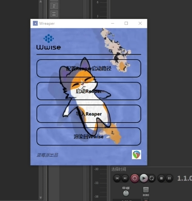
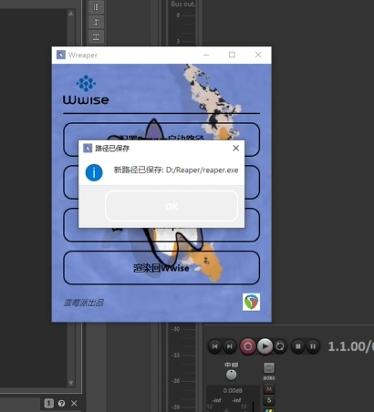

### 二、启动Reaper(直接选择导入时检测到Reaper未开启会自启)
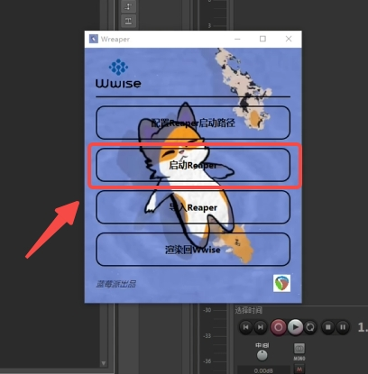
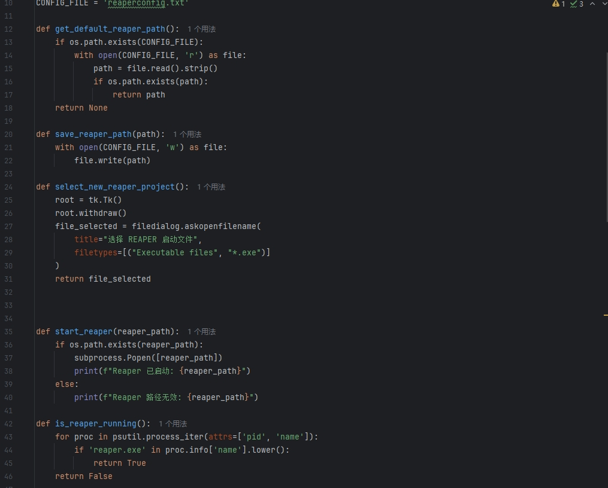

### 三、选择需要修改的音频文件导入Reaper修改
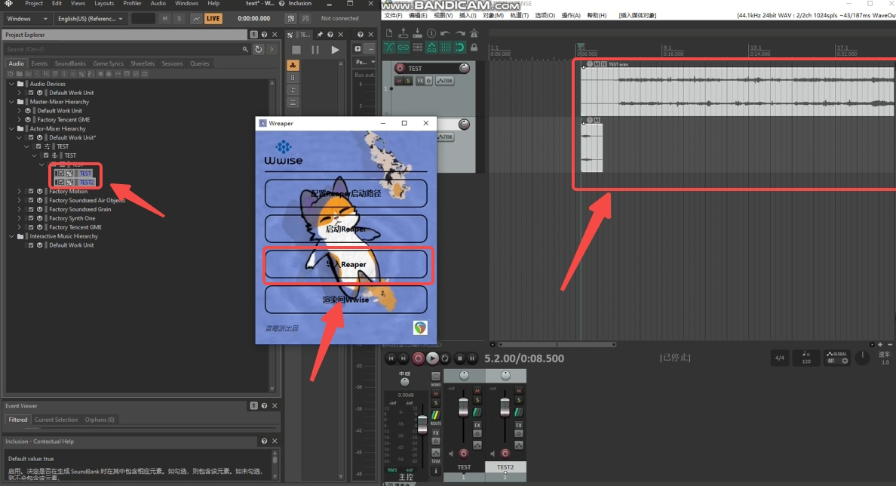
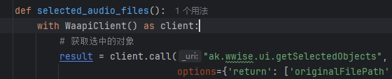

通过ak.wwise.ui.getSelectedObjects获取选择到的音频相关属性后导入Reaper，并为后续做相关映射回通

### 四、将修改回通Wwise替换源音频
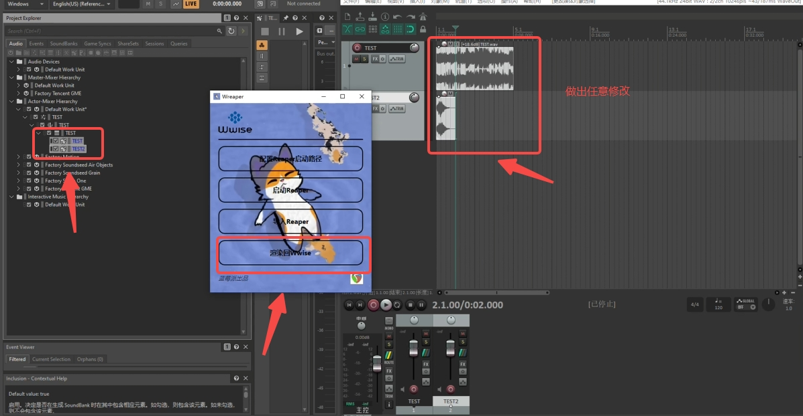

回通后修完完成的音频素材：

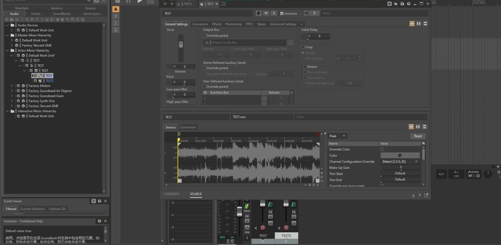

通过从Wwise中获取到的文件路径来作为映射基点，实现Reaper的回通效果

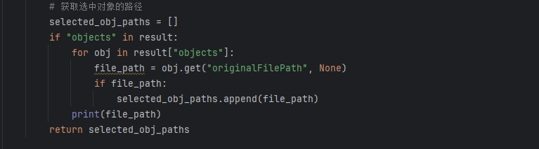

其中对于P4V等版本控制内容需要在过程中额外增添一项取消只读的操作
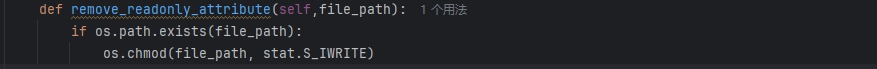

前置操作
需要远程调用Reaper的相关API来进行此步操作，此版本用的是Reapy库

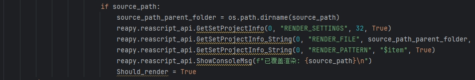
需要让Reaper启用Python以便与ReaScript脚本一起使用

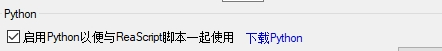

在Reascrpit中启用Reapy即可

### 后续展望：
1.将Wwise中的所有层级也全部导入Reaper并记录层级结构，在Reaper中对层级的相关修改记录也回通至Wwise，用UI体现对应的结构

2.将瞬时连通构建为实时连通，尝试构建一个Reaper样状的可定义Wwise工程，将变为Wwise的混音台

## Bilibili

<iframe width="100%" height="468" src="//player.bilibili.com/player.html?bvid=BV1btZnYtErB" scrolling="no" border="0" frameborder="no" framespacing="0" allowfullscreen="true"> </iframe>
